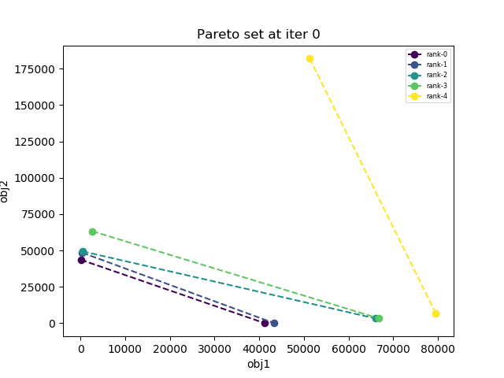
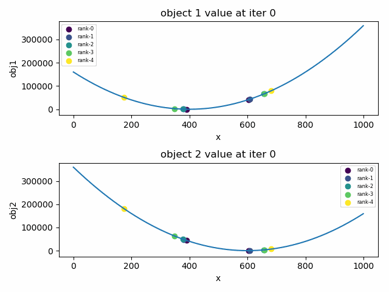

# NSGA-II
A python implement of NSGA-II multi-objective optimization algorithm.

## Paper
Original paper see [here](https://ieeexplore.ieee.org/document/996017).

## Visulization

Following 2 GIFs visulize the optimization process (10 iterations) of multi-objective problem:
- min f_1(x) = (x-400)*(x-400)
- min f_1(x) = (x-600)*(x-600)
  
**x** belongs to the set of real numbers. The first GIF show the change of Pareto front while the second one shows that of population's performance on 2 objectives.

## Usage
Requriment:
- numpy
- matplotlib

I'm still working on refactorring the code. Please be patient.